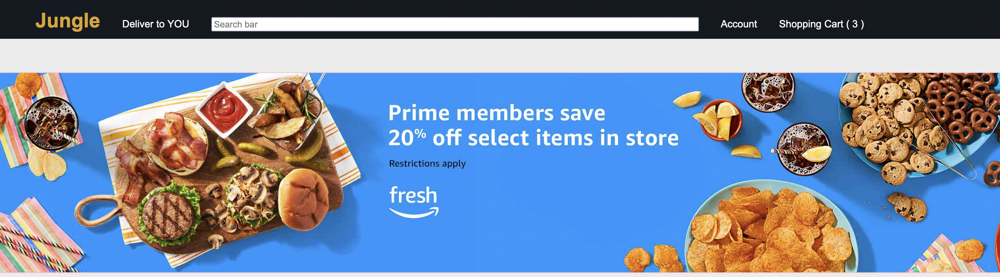

  
  
  <h2>Overview</h2>
  
  This is a full stack e-commerce website inspired by Amazon made with HTML, CSS, JavaScript, EJS, Node, and MongoDB. It has a fully functioning shopping cart feature that allows users to add and delete items from a shopping cart. The shopping cart displays the current order with the current subtotal of all the items in the cart. The user may also update the quantity of each item from their respective pages or from the shopping cart.
  
  <h2>How It Works</h2>
  Click on any item from the home page to see a description page and a button to add the desired quantity of the item to the shopping cart. Once added, you'll be redirected to the shopping cart, where you can see a list of all the items in your shopping cart and edit the quantities of any item in the cart.
 
 
  <h2>Some Things I learned Making This Application</h2>
  
  <ul>
    <li>How to use Mongoose and its aggregate function</li>
    <li>How to use MongoDB to store links and image routes</li>
    <li>Better understanding of EJS</li>
    <li>Better understanding of Mongoose schemas</li>
    <li>Better understanding of APIs and CRUD</li>
    <li>How to use datalists to create autocomplete effect</li>
   </ul>

<h2>Package Dependencies</h2>
cors, dotenv, ejs, express, heroku, mongodb, mongoose

<h2>Future Update Plans:</h2>
    <ul>
        <li>Delete item from shopping cart when quantity drops to 0</li>
        <li>Include status update at top of shopping cart when items are added/removed/edited</li>
        <li>Implement login capability</li>
    </ul>

<h2>Want More?</h2>
If you'd like to see more about me, please visit my <a href="https://www.linkedin.com/in/icyparkinson/">LinkedIn</a>.

If you haven't given it a look yet, check out my <a href="https://rxbuddy.herokuapp.com/">Rx Buddy</a>!
    
